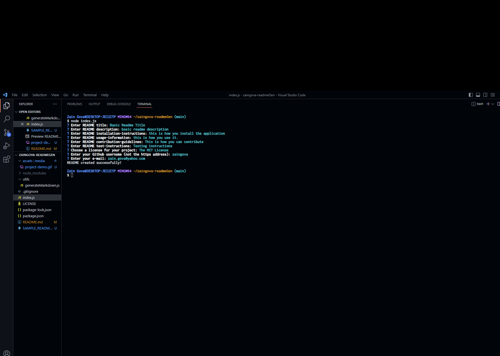

# Zain Gova README Generator (Node.js)

## Description

This is a node.js application used to generate a professional-level README file. It promts the user for various pieces of data, such as the title, description, installation guidelines, contribution guidelines, license, etc; and converts that raw data into a markdown file.

## Visuals

## Usage

[Click here to be re-directed to the Github repository](https://github.com/zaingova/zaingova-readmeGen)

To use this app, you'll need to open your terminal and type the command "npm init -y" followed by "npm i inquirer@8.2.4" to get the correct version of Inquirer installed. Then, in the terminal, type "node index.js" to begin the program. It will take you through all sections of the README and at the end, it genates a new fiile called SAMPLE_README.md.

## License

MIT License

[Click here to learn more about the license used](https://opensource.org/licenses/MIT)